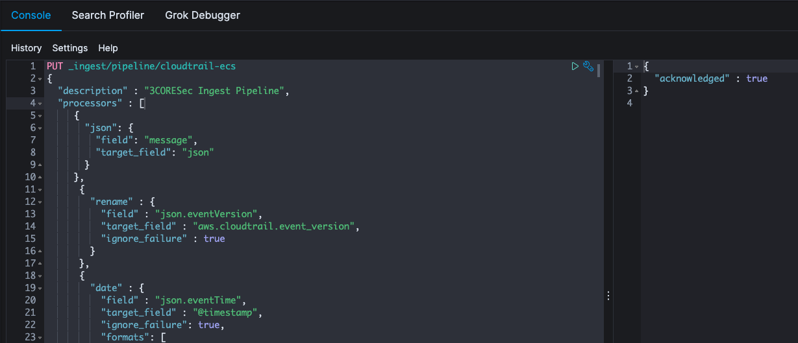
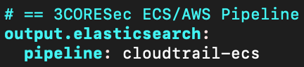

# AWS CloudTrail (& more!) pipeline for Functionbeat

## Project goals
The goal of this project is to create an ingestion pipeline for Elasticsearch while staying in sync with Elastic in their developments of mapping AWS CloudTrail data fields to [ECS](https://www.elastic.co/guide/en/ecs/current/index.html) or by defining them as [AWS-specific](https://www.elastic.co/guide/en/beats/filebeat/master/exported-fields-aws.html) *(also known as export fields)*. 

The usage of this pipeline is particularly useful when integrating this normalization with [Functionbeat](https://www.elastic.co/beats/functionbeat).

## Why not use the work done by Elastic?

**Short answer:** We use [Functionbeat](https://www.elastic.co/beats/functionbeat) while Elastic decided to develop the transformations on [Filebeat](https://www.elastic.co/beats/filebeat).

**More detailed answer:**

There are two separate tasks that need to be performed in order to normalize a source:

* Define a standard that takes into account the fields as they exist in the origin and how we'd like to transform them
* Create a transformation pipeline that, based on the standard, makes those changes

We're inline with the standards defined by Elastic, however, we chose to transform them differently. 

As users of [Functionbeat](https://www.elastic.co/beats/functionbeat), and since Elastic's focus was on performing transformations through [Filebeat](https://www.elastic.co/beats/filebeat), we applied their methodology in a different transformation mechanism *(one that can be utilized by Functionbeat)*.

## What AWS services are supported by this project?

Initially we were planning to support solely AWS CloudTrail. Eventually we received requests for additional services *(that could have their logs passed to Functionbeat)* and ended up increasing the scope of the project.

Please check the reference table below for additional details.

# Pipeline Reference Fields
Formatting of the table in Github didn't look so good, so we moved the reference table to a [Google Sheet](https://docs.google.com/spreadsheets/d/1rtyP4s3R5iu55ob2uNWfbUoUO_GGBNOUV-PiHcCEMjI).

In it you'll find a full mapping of the pipeline and what services are supported. 

## Sigma Integration?

In an effort to bring all the pieces of the puzzle together we also share our work with the [Sigma project](https://github.com/Neo23x0/sigma). The reference document mentioned above will include information as to whether we've shared the mapping with Sigma or not.

# Pipeline installation

**Pipeline:** [cloudtrail-ecs.json](./cloudtrail-ecs.json)

## Integration with Functionbeat
Just add the following to your **functionbeat.yml**:

# Additional fields?
We're constantly analyzing AWS CloudTrail data and [services that support it](https://docs.aws.amazon.com/awscloudtrail/latest/userguide/cloudtrail-aws-service-specific-topics.html) to improve the pipeline. 

If you have a particular request or you found a bug in the pipeline, feel free to open an issue. 

# Community Slack
If this type of project interests you and you'd like to talk more about it, consider registering for our [Community Slack](https://launchpass.com/3coresec).
